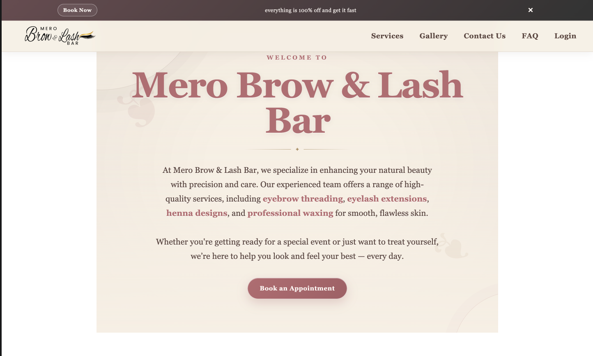
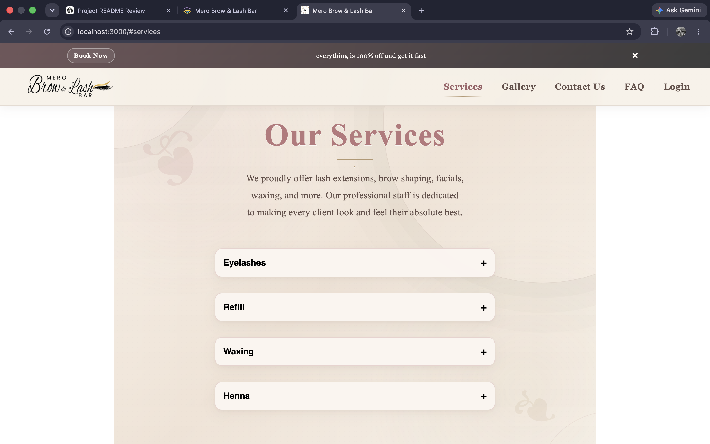
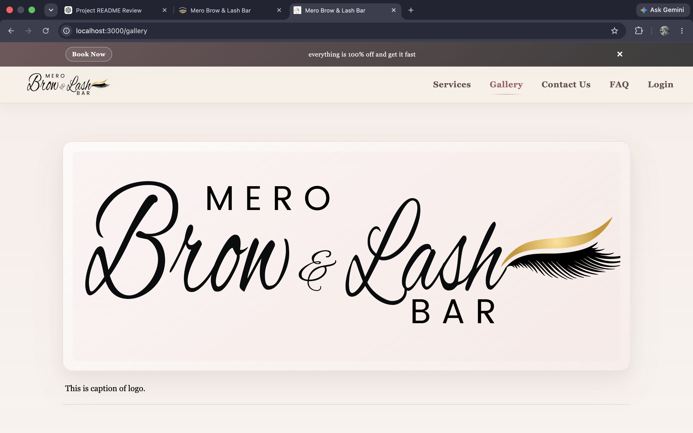
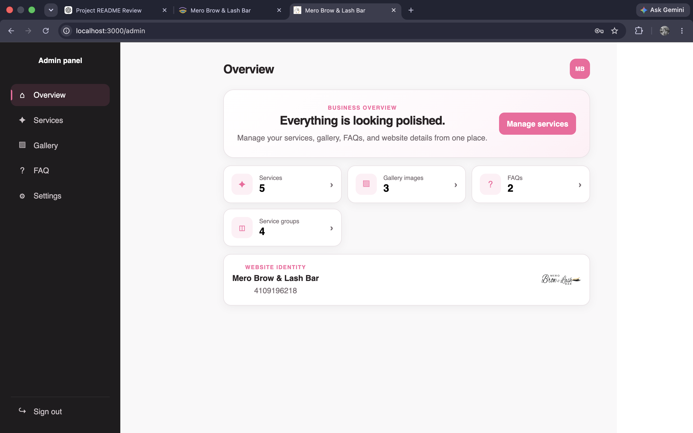
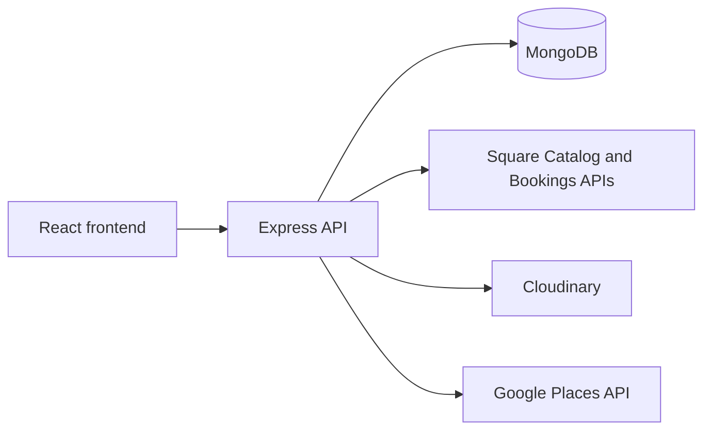

# Mero Brow & Lash Bar

A full-stack business website and content-management dashboard for Mero Brow & Lash Bar. It gives clients a responsive way to explore services, recent work, reviews, and business information while allowing administrators to keep that content current without code changes.

## Overview

The application has four connected parts:

- **Public website:** a React JavaScript/JSX single-page experience for Square Catalog services, an in-site booking flow, gallery work, Google reviews, FAQs, contact details, business hours, and offers.
- **Admin dashboard:** an authenticated interface for managing gallery items, FAQs, business settings, logo, and homepage offer content.
- **Express API:** validates requests, protects administrator actions, handles uploads, and serves public and admin data.
- **Data and external services:** MongoDB stores site content and administrator data; Square is the source of truth for bookable services, availability, customers, and appointments; Cloudinary stores uploaded media; Google Places supplies review data.

## Features

### Public Website

- Responsive desktop and mobile navigation with section scrolling
- Square Catalog-driven service menu and pricing
- In-site booking with Square availability and appointment creation; customers are not redirected to a Square booking page
- Gallery with captions, lazy loading, scroll-reveal animation, and loading, error, and empty states
- Google Places reviews in a motion-aware carousel
- Database-driven FAQ accordion with category filtering
- Contact details, map directions, and business hours
- Configurable logo and dismissible homepage offer

### Admin Dashboard

- Protected sign-in and sign-out
- Gallery image upload, caption editing, replacement, and deletion
- FAQ creation, editing, activation, ordering, and deletion
- Business contact details, logo, and homepage-offer management

### Engineering and UX

- Responsive CSS layouts and component-level styling
- Loading, error, and empty states for dynamic content
- Keyboard-accessible navigation, accordions, menus, and modals
- Semantic controls and ARIA labels/states where appropriate
- Reduced-motion support for animated UI elements
- Client-side page transitions and scroll behavior

## Screenshots

### Homepage



### Services



### Gallery



### Admin Dashboard



### Mobile Homepage


## Architecture



The React application calls the Express API through `/api`. Square Catalog is the source of truth for bookable services; the API uses Square availability and booking APIs for the custom in-site booking flow. MongoDB persists gallery records, FAQs, settings, administrator data, and other application state, but is not the source of truth for bookable services. The retired MongoDB Service model, Service API/routes, and admin Service Manager are not part of the active architecture. Images are uploaded to Cloudinary; their URLs and public IDs are stored with the relevant MongoDB record. Review data is fetched by the API from Google Places, normalized, and cached in memory for 24 hours before being returned to the frontend.

## How It Works

### Content Management

`Admin Dashboard → Express API → MongoDB → Public Website`

Administrators update business content through protected API routes. The public website retrieves the latest gallery items, FAQs, and settings from those routes; the booking flow retrieves bookable services from Square through the API.

### Booking

`Customer → React booking flow → Express API → Square Catalog / Availability / Bookings APIs`

Customers select Square Catalog services, choose an available time, provide their details, and confirm within the site. The server validates the booking request and creates the Square customer and appointment; it does not redirect customers to the retired Square booking page.

### Image Uploads

`Admin Dashboard → Express API → Cloudinary → MongoDB record`

Gallery and logo uploads are handled by Multer with Cloudinary storage. The server accepts JPG, PNG, and WebP images up to 5 MB, stores the returned image reference, and cleans up replaced or deleted Cloudinary assets.

### Google Reviews

`React frontend → Express API → Google Places API`

The reviews endpoint fetches and normalizes Google Places review data. A successful response is cached server-side for 24 hours; a stale cached response is used if a later upstream request fails.

### Authentication

`Login → Express API → signed JWT in HTTP-only cookie → protected admin routes`

The server verifies the JWT, administrator role, and a stored session version before servicing protected requests. Signing out increments the session version, invalidating existing tokens for that administrator.

## Tech Stack

| Technology          | Purpose                                    |
| ------------------- | ------------------------------------------ |
| React 19            | JavaScript/JSX public website and admin dashboard UI |
| React Router        | Client-side routes and section navigation  |
| Framer Motion       | Page, menu, modal, and UI animations       |
| CSS                 | Responsive component styling               |
| Node.js             | Server runtime                             |
| Express             | REST API and middleware pipeline           |
| MongoDB + Mongoose  | Persistent application data and models     |
| Cloudinary + Multer | Image storage and upload handling          |
| bcryptjs            | Administrator password hashing             |
| JSON Web Tokens     | Signed administrator authentication tokens |
| Google Places API   | Business review data                       |

## Project Structure

```text
├── public/                 # Static browser assets
├── screenshots/            # README screenshots
├── src/
│   ├── api/                # Client-side API request helpers
│   ├── components/         # Shared FAQ, modal, upload, reveal, and transition components
│   ├── AdminDashboard/     # Protected content-management interface
│   ├── ContactUs/, Home/   # Public homepage sections
│   ├── Gallery/, Reviews/  # Public gallery and review features
│   ├── Header/, Footer/    # Shared public layout
│   ├── Login/              # Administrator sign-in UI
│   ├── Services/           # Square-powered service menu
│   └── constants/          # Shared UI and category definitions
├── server/
│   ├── src/bootstrap/      # Initial administrator setup
│   ├── src/config/         # application and external-service configuration
│   ├── src/controllers/    # API request handlers
│   ├── src/middleware/     # Authentication, uploads, rate limiting, and error handling
│   ├── src/models/         # Mongoose schemas
│   ├── src/routes/         # Express route modules
│   └── src/utils/          # Validation, token, error, and media helpers
└── package.json            # Scripts and dependencies
```

## Frontend Routes

| Route      | Access    | Description                                                    |
| ---------- | --------- | -------------------------------------------------------------- |
| `/`        | Public    | Homepage with reviews, services, contact information, and FAQs |
| `/gallery` | Public    | Gallery of published work                                      |
| `/login`   | Public    | Administrator sign-in modal                                    |
| `/admin/*` | Protected | Administrator dashboard; `/admin/faq` opens the FAQ section    |

Unknown client routes display a not-found page. Homepage navigation uses hashes to scroll to services, contact, and FAQ sections.

## API Routes

### Health and Admin

| Endpoint             | Method | Access | Purpose                                                  |
| -------------------- | ------ | ------ | -------------------------------------------------------- |
| `/api/health`        | `GET`  | Public | API health check                                         |
| `/api/admin/login`   | `POST` | Public | Authenticate an administrator and set the session cookie |
| `/api/admin/session` | `GET`  | Public | Return current authentication status                     |
| `/api/admin/logout`  | `POST` | Admin  | Invalidate the admin session and clear the cookie        |

### Square Menu, Gallery, and FAQs

| Endpoint                | Method   | Access | Purpose                                      |
| ----------------------- | -------- | ------ | -------------------------------------------- |
| `/api/square/menu`      | `GET`    | Public | Retrieve Square appointment services for the public menu |
| `/api/square/booking-services` | `GET` | Public | Retrieve bookable Square services for the in-site booking flow |
| `/api/square/availability` | `POST` | Public | Retrieve Square availability for selected services and date |
| `/api/square/bookings` | `POST` | Public | Validate and create a Square booking |
| `/api/gallery`          | `GET`    | Public | Retrieve gallery items                       |
| `/api/gallery`          | `POST`   | Admin  | Upload and create a gallery item             |
| `/api/gallery/:id`      | `PUT`    | Admin  | Update a gallery item or image               |
| `/api/gallery/:id/like` | `PATCH`  | Public | Increment a gallery item's like count        |
| `/api/gallery/:id`      | `DELETE` | Admin  | Delete a gallery item and its uploaded image |
| `/api/faqs`             | `GET`    | Public | Retrieve active FAQs                         |
| `/api/faqs/admin`       | `GET`    | Admin  | Retrieve all FAQs                            |
| `/api/faqs`             | `POST`   | Admin  | Create an FAQ                                |
| `/api/faqs/:id`         | `PUT`    | Admin  | Update an FAQ                                |
| `/api/faqs/:id`         | `DELETE` | Admin  | Delete an FAQ                                |

### Settings and Reviews

| Endpoint        | Method | Access | Purpose                                             |
| --------------- | ------ | ------ | --------------------------------------------------- |
| `/api/settings` | `GET`  | Public | Retrieve business settings, logo, and offer content |
| `/api/settings` | `PUT`  | Admin  | Update settings and optionally upload a logo        |
| `/api/reviews`  | `GET`  | Public | Retrieve normalized Google Places reviews           |

## Getting Started

### Prerequisites

- Node.js 22.x (production validation uses v22.23.2)
- MongoDB database
- Cloudinary account for administrator image uploads
- Google Places API credentials for the reviews feature

### Installation

```bash
npm install
```

Create a `.env` file in the repository root. Keep it local and never commit credentials.

### Environment Variables

| Variable                    | Required         | Purpose                                                                         |
| --------------------------- | ---------------- | ------------------------------------------------------------------------------- |
| `MONGODB_URI`               | Yes              | MongoDB connection string                                                       |
| `JWT_SECRET`                | Yes              | Secret used to sign and verify administrator tokens                             |
| `ADMIN_USERNAME`            | On first startup | Username for the initial administrator account                                  |
| `ADMIN_PASSWORD`            | On first startup | Password for the initial administrator account; also required when resetting it |
| `CLOUDINARY_CLOUD_NAME`     | For uploads      | Cloudinary account name                                                         |
| `CLOUDINARY_API_KEY`        | For uploads      | Cloudinary API key                                                              |
| `CLOUDINARY_API_SECRET`     | For uploads      | Cloudinary API secret                                                           |
| `GOOGLE_PLACES_API_KEY`     | For reviews      | Google Places API key                                                           |
| `GOOGLE_PLACE_ID`           | For reviews      | Google Place identifier for the business                                        |
| `PORT`                      | No               | API port; defaults to `5001`                                                    |
| `CLIENT_URL`                | No               | Allowed CORS origin; defaults to `http://localhost:3000`                        |
| `JWT_EXPIRES_IN`            | No               | JWT lifetime; defaults to `7d`                                                  |
| `SESSION_COOKIE_MAX_AGE_MS` | No               | Session cookie lifetime; defaults to seven days                                 |
| `ADMIN_RESET_PASSWORD`      | No               | Set to `true` to reset the existing administrator password at startup           |
| `NODE_ENV`                  | No               | Enables secure cookies when set to `production`                                 |

### Run Locally

```bash
npm run dev
```

This starts the React development server on port `3000` and the API server on port `5001` by default. The React client proxies API requests to the local server.

### Production Build

```bash
npm run build
```

The optimized client bundle is written to `build/` without source maps. Production deployment uses the SHA-based immutable-release process under `infrastructure/`; its runbook creates a release directory for the committed SHA, atomically switches `current`, validates health, and provides rollback support.

## Available Scripts

| Command          | Description                                                            |
| ---------------- | ---------------------------------------------------------------------- |
| `npm start`      | Start the Express API server                                           |
| `npm run client` | Start the React development server                                     |
| `npm run server` | Start the API server with nodemon                                      |
| `npm run dev`    | Run the client and API server together                                 |
| `npm run build`  | Create an optimized client build in `build/`                           |
| `npm test`       | Run the React test suite                                               |
| `npm run deploy` | Run the authorized SHA-based immutable-release deployment script |

## Testing

Run the client test suite with:

```bash
npm test
```

The project uses Jest through Create React App together with React Testing Library for frontend tests, plus Node's built-in test runner for backend, security, booking, and deployment-engineering tests.

## Deployment

The deployment script under `infrastructure/deploy/` deploys one committed SHA at a time into an immutable release directory, then atomically switches the `current` symlink after its preflight checks. It requires Node 22, a clean release checkout, sufficient disk space, valid production configuration, healthy nginx/systemd configuration, and successful health checks. See `infrastructure/deploy/README.md` before any authorized production deployment.

## Authentication and Security

- Passwords are hashed with bcrypt before storage.
- Successful login creates a signed JWT stored in an HTTP-only, `SameSite=Lax` cookie. Cookies are marked `Secure` in production.
- Protected routes require a valid token, an administrator role, and a matching session version. Logout increments the version to invalidate existing tokens.
- Login attempts are rate-limited to 10 requests per 15-minute window per client IP.
- API payloads and MongoDB identifiers are validated before persistence.
- Uploads accept only JPEG, PNG, and WebP files, with a 5 MB limit.
- CORS is restricted to `CLIENT_URL`, and centralized error middleware omits stack traces in production responses.

## Accessibility

The UI uses semantic buttons and links, labels form inputs, and supplies ARIA labels and state for navigation, menus, FAQ accordions, dialogs, and status/error feedback. Menus and modals support Escape-key dismissal, interactive address content supports keyboard activation, and Framer Motion animations respect the operating system’s reduced-motion preference.

## Key Engineering Decisions

- **Database-driven content:** gallery items, FAQs, and business settings can be updated without redeploying the public site.
- **Square-backed booking:** Square Catalog, availability, customer, and booking APIs support the custom in-site booking flow; MongoDB Service infrastructure is retired.
- **Cloud-hosted media:** Cloudinary keeps uploads out of the application filesystem and allows the API to clean up replaced assets.
- **Server-side review integration:** Google credentials remain on the server, while the frontend receives only the normalized review data it needs.
- **Cookie-based admin access:** signed JWTs remain inaccessible to client JavaScript and protected actions are enforced by the API, not only the frontend route guard.

## License

This repository is private. All rights reserved.
